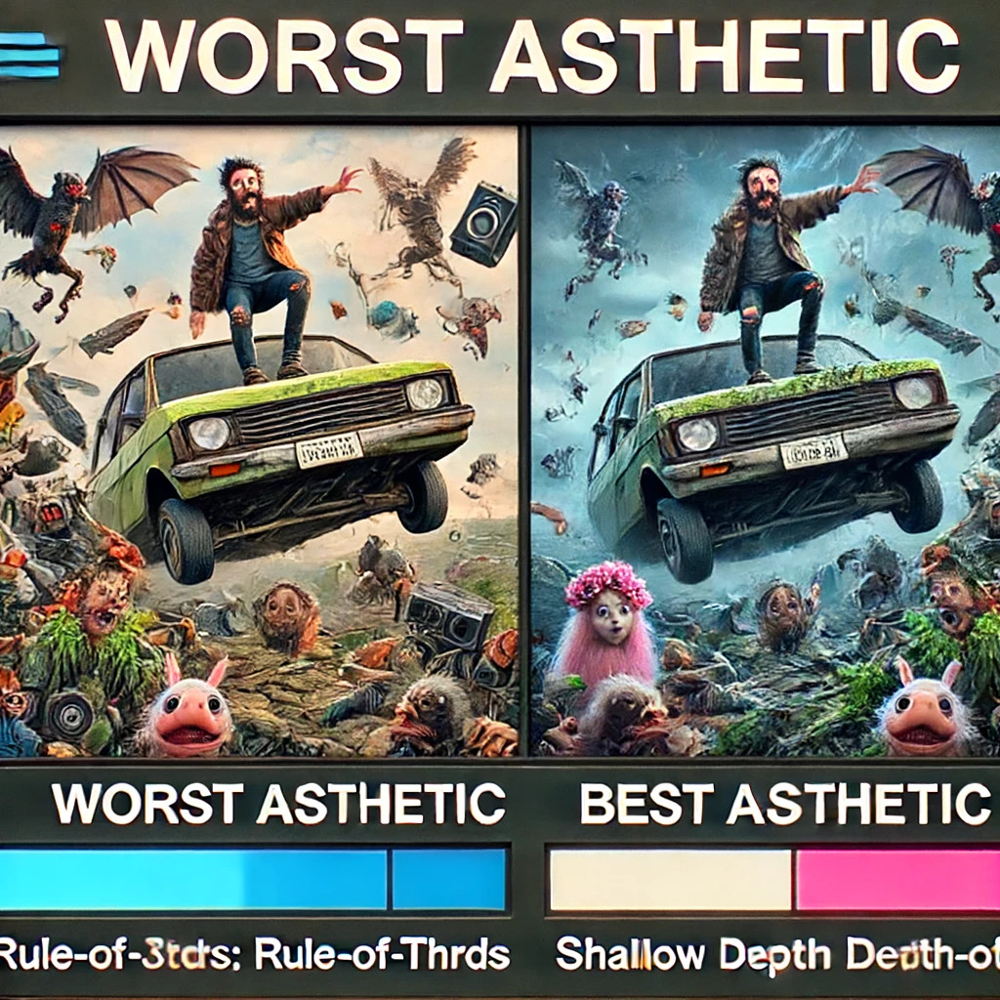

# DOVER-video-quality-assessment-replicate

Replicate package for [DOVER video quality assessment](https://github.com/VQAssessment/DOVER)

**WARNING: I could not replicate the precise results from [the DOVER
repo](https://github.com/VQAssessment/DOVER/blob/master/evaluate_one_video.py),
despite copying their implementation directly and controlling random
seeding.**

## DOVER: Disentangled Objective Video Quality Evaluator

### Overview

DOVER is a specialized video quality assessment model for user-generated
content, designed to analyze videos from both aesthetic and technical
perspectives.



### Features
- **Dual Perspective Analysis**: Separately evaluates aesthetic appeal and technical quality.
- **Pre-trained Model**: Available on Hugging Face for easy integration.
- **High Accuracy**: Utilizes advanced research to ensure precise quality assessments.

### Use Case

Ideal for platforms hosting and managing user-generated video
content, providing insights into both the technical and aesthetic
quality of videos.

## Dev

```
cog push r8.im/turian/dover-video-quality-assessment
```

## TODO
* Allow DOVER++ and DOVER-mobile
* Allow batch of videos
